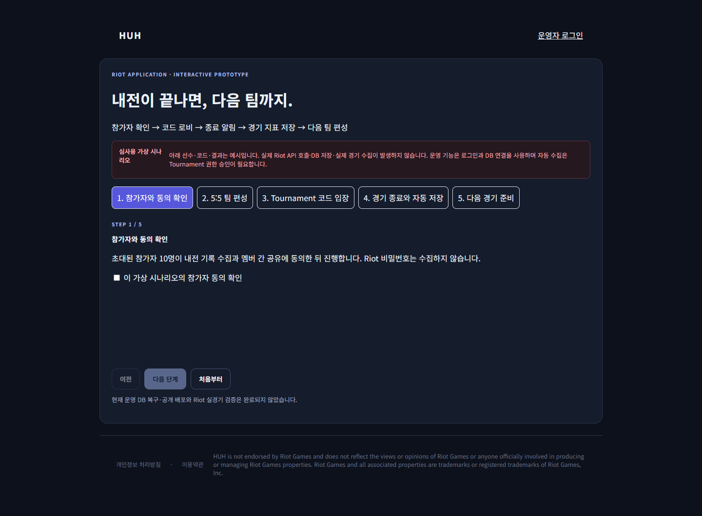
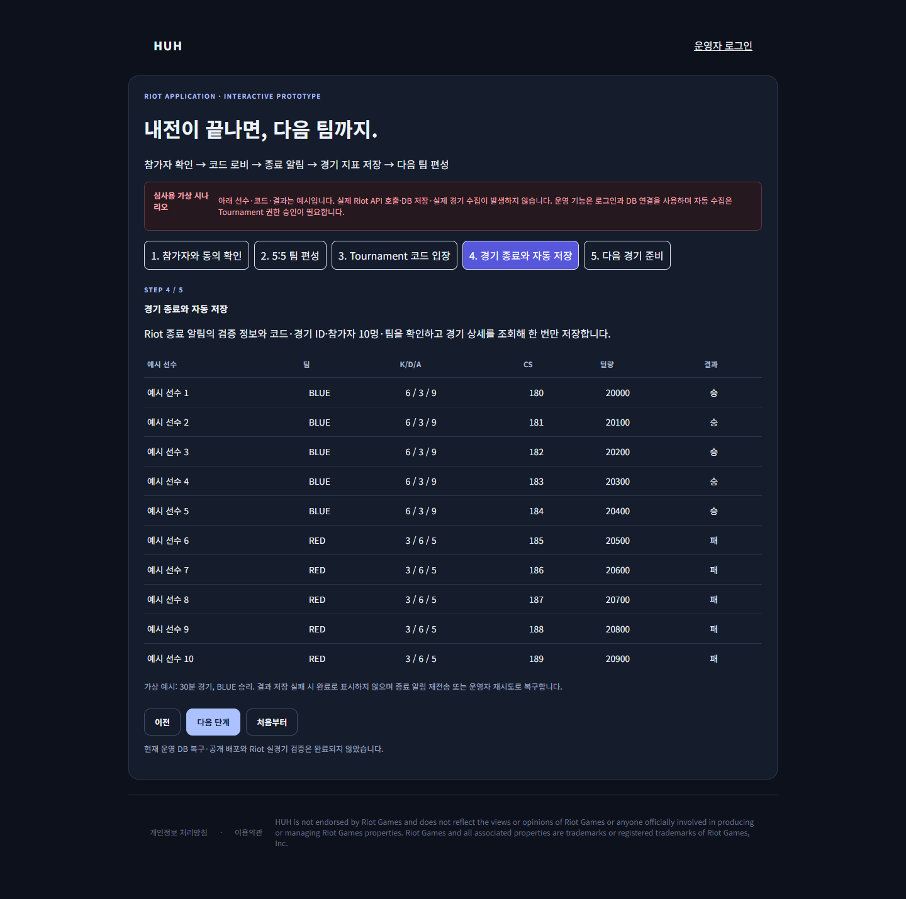

# Riot Production / Tournament access application

## Current status

This branch includes an interactive review prototype and a server implementation for Tournament code creation and result collection. The synthetic review prototype is publicly deployed at https://huh-riot-review.vercel.app/#/review and was verified in an unauthenticated browser. The server implementation has a protected Vercel preview; production activation is pending database recovery. The existing backend reports a disconnected database. The developer does not have approved Tournament access and has not verified this flow with a real Riot custom match. Do not describe the prototype as live automatic collection. The server behavior below is implemented and covered by isolated tests, not a demonstrated guarantee against live Riot or Supabase services.

## Product description (application draft)

HUH is a non-commercial League of Legends inhouse management tool for an invited Korean community. Organizers select ten consenting participants, assign two teams and five roles, generate a single-use Tournament code, and share it with the players. Players join the code-created lobby in the official League client.

We request Production access to Tournament-v5 and Match-v5 for KR matches. After a code-created match ends, a server callback triggers collection of the verified match details. The backend verifies callback metadata, the registered code and game ID, all ten participant PUUIDs, and their planned teams before importing the result into the existing Supabase PostgreSQL database. The callback does not itself supply authoritative player statistics.

Saved data includes actual game start time, duration in seconds, champion, win/loss, K/D/A, CS, gold, champion damage and vision score. Internal community statistics help organizers prepare the next inhouse lineup. HUH does not estimate official ranked MMR or replace the official ranked ladder. Positions reflect the roles organizers confirmed before the match.

Participant records are available only through authenticated organizer access. Organizers must confirm that all ten participants specifically consent to LoL custom-match record collection and sharing before requesting a code. The server records the organizer's attestation, time and roster snapshot; this is not automated identity or consent verification. No real participant records are exposed in the public review prototype. We do not collect Riot passwords, run an in-game overlay, or charge fees.

The Riot key remains server-side and is encrypted when stored in the existing settings database. Duplicate callbacks do not duplicate the result. Failed imports roll back, produce an error and can be retried. Ambiguous code-creation responses are held for operator investigation instead of issuing another code automatically.

## Review instructions

1. Open `https://huh-riot-review.vercel.app/#/review` (login is not required). Local review: start the branch and open `http://localhost:5173/HUH/#/review`.
2. Confirm the scenario checkbox and follow all five steps: participants → 5v5 → code lobby → result collection → next match.
3. All prototype players, codes and results are explicitly synthetic. No Riot requests or database writes occur on this page. It illustrates the intended player experience rather than proving the live integration.
4. Privacy policy and terms are linked from the page. Actual organizer functions require a prepared review account and a working backend.
5. If the public prototype is unavailable, provide screenshots or a recording of the local prototype and explain that deployment and Tournament access are pending. A repository URL alone is insufficient.

## Before submitting

- Public prototype deployment verified: a fresh unauthenticated browser rendered ten synthetic results with no page errors and no API requests.
- Verify policy pages and a private route for participant correction/removal requests with the organizer. Do not put real participant details in public GitHub issues.
- Describe exactly what was tested: unit tests and isolated PostgreSQL import tests are complete; public synthetic prototype deployment is verified; actual Supabase login/storage and live Tournament callbacks remain pending.
- Confirm whether Riot will approve this specific community use of Tournament access. Access and application approval are Riot's decision.

## Activation after approval (deployment operator)

Inspect the existing Supabase data and migration history; apply only missing migrations, including 005–007. Restore the existing backend connection and verify organizer authentication and storage. Register a KR Tournament Provider with the actual callback URL ending in `/api/tournament-callback`. The server adapter provides `createProvider`; provider provisioning is an operator task and is not performed automatically on site login. Confirm Riot accepts the callback domain/certificate before setting `TOURNAMENT_PROVIDER_ID` and explicitly enabling `TOURNAMENT_API_ENABLED=true`.

Bind the provider to the approved key, then use ten consented test participants to run one real code-created match. Check the actual Match-v5 response contract: tournament code, gameStartTimestamp, gameDuration, map, team IDs and statistics. The current collector rejects missing/mismatched fields rather than guessing. Verify callback delivery, storage, repeated delivery, failure/retry and a separate browser session's view of the same records before presenting the feature as operational. Rotating the key or changing the callback URL requires provider review/re-registration.

## Official sources

- [Production use cases and prototype review](https://developer.riotgames.com/docs/lol#use-cases-for-production-keys)
- [Production application guidance](https://support-developer.riotgames.com/hc/en-us/articles/22801383038867-Production-Key-Applications)
- [Tournament code, callback and provider documentation](https://developer.riotgames.com/docs/lol#tournament-api)
- [Developer policies and API keys](https://developer.riotgames.com/docs/portal)

HUH is not endorsed by Riot Games and does not reflect the views or opinions of Riot Games or anyone officially involved in producing or managing Riot Games properties. Riot Games and all associated properties are trademarks or registered trademarks of Riot Games, Inc.

## Review screenshots (synthetic scenario)

